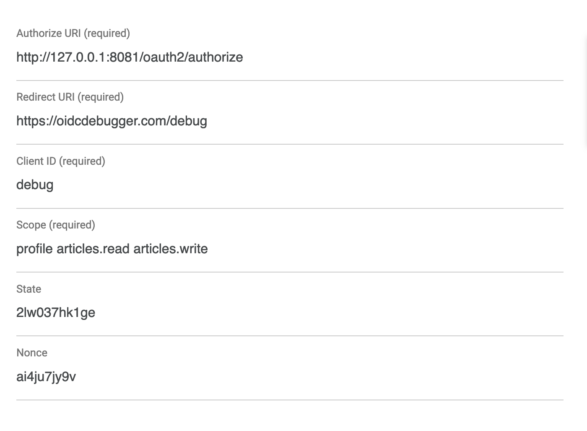

# OAuth 2 - OpenID connect

## Theory

### Description

OAuth (short for open authorization) is an open standard for access delegation, commonly used as a way for internet users to grant websites or applications access to their information on other websites but without giving them the passwords.

Service consumer(application) can request user to authorize it to get access to user data from service provider without making user to have manual give those data. Usually, service provider will authenticate and authorize service consumer via a access token. This will also isolate the user authentication step to only within ether the service consumer or service provider and not sharing each other user's password.

Latest version is OAuth 2.0

### Generic flow

Assuming the resource provider as first party that protecting user information

Actors:

- *User*: the current human user
- Resource Authorization Server - *ASrv*: first party service authorization server. Have *User* credential
- Resource Server - *RSrv*: first party service resource server, containing protected data, including *User* information
- Client Frontend - *CFront*: third party service client side that the user will interact with
- Client Backend - *CBack*: third party service server side

FLOW

1. Get `authorization_code`(Granting Authorization)

    - Third party ask *User* for credential and some additional information for its usage
    - *User* ask *CFront* to ask First party
    - *CFront* redirect *User* to *ASrv* with OAuth `scope`, `client_id`, `redirect_uri`, and security states
    - *ASrv* Verify if Third party *CFront* providing correct client formation
    - *ASrv* authenticated with *User*(Logging in)
    - *Asrv* redirect *User* back to Third party via `redirect_uri` with `authorization_code` and security states
    - *CBack* verify security states and proceed with with getting `access_token`

2. Get `access_token`(Used Granted Authorization)

    - *CBack* ask *ASrv* for `access_token` by sending the `authorization_code` with `client_secret`(also included `redirect_uri`, `client_id` for security purposes)
    - *ASrv* verify the request, and obtain the requested `scope` for `access_token`
    - *ASrv* mark `authorization_code` as unusable
    - *ASrv* send `access_token` back to *CBack*
    - *CFront* tell *User* that the process has been done

3. Get Resource
    - \[OPTIONAL\] *CBack* may stored `access_token` for later usage
    - *CBack* ask *RSrv* for resource by sending `access_token`
    - *RSrv* verify with *ASrv*, and check for `access_token`'s `scope` for access control
    - *RSrv* response the requested resources to *CBack*
    - *CBack* processes resources

## Spring Implementation

Include `spring-boot-starter-oauth2-authorization-server` for implementing oauth2 authorization server

- To config oauth2 authorization server, add a first order(HIGHEST_PRECEDENCE) security filter for oauth related configuration (See doc/tutorial)

- This will also include resource server implementation if needed. When configuring security filter change, oauth2 resource server filter order must after oauth2 authorization server filter

Include `spring-boot-starter-oauth2-resource-server` for implementing oauth2 resource server.  Resource server security will be a combination of oauth.jwt and generic spring security filter as authorization

Spring also provided oauth client if needed

## Testing

OAuth2 Authentication flow test: Use [OpenID Connect Debugger](https://oidcdebugger.com), with config:

OAuth2 getting Access Token flow: VS-Code's Rest Client extension with `auth-test.http` script

- Fill the client `authorization_code` with OpenID Connect Debugger result, then obtain the `access_token`, fill that to other urls
- When writing new resource server test, add `Authorization` header with `Bearer {{access_token}}`
